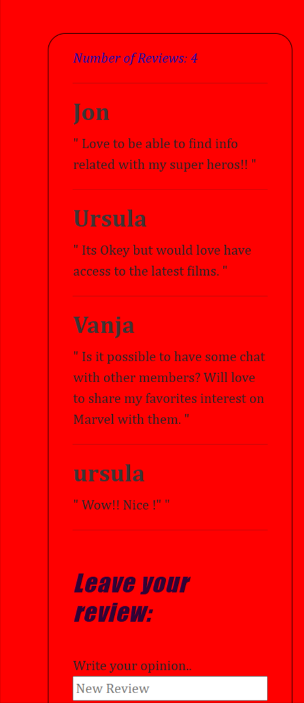

### February 2024

### Marvel App (Vite + Vue) >> Find your Super Hero

**Project Summary**

Marvel App is a Vue 3 single-page application built with Vite that lets users explore Marvel characters via the official Marvel API. Upon entering their name, users see a personalized greeting and a grid of 14 featured superhero cards. They can click any card to view detailed information fetched by character ID, including images, descriptions, and related comics or events. A search field (powered by Axios) returns up to 10 matching characters with thumbnails, basic info, and links to the Marvel website, accompanied by a loading animation during requests. Each character detail view also supports adding comments—automatically tagged with the user’s name (or “Anonymous” if none was provided)—and displays an updated comment count. The app demonstrates core Vue concepts (reactivity, computed properties, watchers), Vue Router for dynamic routes (/detail/:id), and component-based architecture with prop validation.

This application allows the user to interact with the public Marvel API as follows:

1. **Personalization on Load**

   - When the page loads, the user is prompted to enter their name.
   - The interface is updated to display the entered name in various places (e.g., “Welcome, <your name>!”).

2. **Display of Superheroes (14 Initial Cards)**

   - After confirming the user’s name, the app shows 14 cards featuring different Marvel characters (selected so as not to overload the page).
   - Each card displays the character’s image and name.

3. **Character Detail View**

   - Clicking any of the 14 cards opens a dedicated view for that superhero.
   - In this view, the app fetches data from the Marvel API by the character’s `id` and displays:
     - A high-resolution image (if available).
     - Full name.
     - Description (or “No description available” if the API returns an empty description).
     - A list of related comics, series, or events associated with the character.

4. **Search for Characters**

   - There is a search input (`v-model`) where the user can type a character name.
   - Pressing “Search” (or hitting Enter) triggers an Axios request to the Marvel API, returning up to **10 results** that match the query.
   - While the request is in progress, a **loading animation** (spinner) is displayed.
   - Each returned card shows:
     - A thumbnail image of the character.
     - The character’s name.
     - An external link to the official Marvel website for more information.
   - If no matches are found, a message “No results found” is displayed.

5. **Add Comment Functionality**
   - In the character detail view, there is an “Add Comment” section.
   - The user (identified by the name they entered on load) can write a comment for that hero.
   - A counter displays “X comments” and updates automatically whenever a new comment is added.
   - If the user did not enter a name, comments are marked as “Anonymous.”

---

### 🛠️ Technologies Used

- **Vite** – Development server and build tool for fast, modern workflows.
- **Vue 3** – JavaScript framework for building reactive user interfaces.
- **Vue Router (v6)** – Client-side routing to create a seamless Single Page Application.
- **Axios** – Promise-based HTTP client for making API requests to the Marvel API.
- **JavaScript (ES6+)** – Core language for application logic and component scripts.
- **HTML5 & CSS3** – Markup and styling for responsive, modern layouts.
- **ESLint & Prettier** – Code linting and formatting to enforce consistency and best practices.
- **dotenv** (Vite’s environment handling) – Securely manage Marvel API keys via `.env` files.
- **Git & GitHub** – Version control and repository hosting.
- **Node.js (v16 LTS)** – Runtime for development scripts and package management (npm).
- **npm** – Package manager for installing dependencies and running build/dev commands.

---

### General view:





---

### 🔧 Installation and Usage

1.  **Clone or download** the project folder

    ```bash
    git clone <your-repo-url>
    cd <project-folder>
    ```

2.  **Install Dependencies**

    ```bash
    npm install
    ```

3.  **Configure Environment Variables**

    - Create a `.env` file in the project root and add your Marvel API keys:

           ```env
           VITE_MARVEL_PUBLIC_KEY=your_public_key_here
           VITE_MARVEL_PRIVATE_KEY=your_private_key_here
           VITE_MARVEL_HASH=calculation_md5
           VITE_MARVEL_TS=1

      ```

      ```

    - Never commit your private key to a public repository.

    (In this case you can find both as an exception to be able to run the repo on apiKey.txt
    but otherwise should be hidden)

4.  **Run in Development Mode**

    ```bash
    npm run dev
    ```

    - The app will be available at `http://localhost:3000` (or the port shown by Vite).
    - Enter your name on load and start exploring the app.

---

### 📝 Additional Notes

- The Marvel API returns paginated results. For the initial display, limit the request to 14 characters. In the search, use `limit=10` to avoid overloading the UI.
- The comment counter updates in real time thanks to Vue’s reactivity.
- To persist comments, use `localStorage` (e.g., key `comments_character_<id>`) or a simple central store (Pinia/Vuex) if desired.
- When deploying this app (on Netlify, Vercel, GitHub Pages, etc.), run `npm run build` and host the contents of the `dist/` folder on a static server.

---

### 📄 [Detailed Information of the Project](Detail_Info.md)
